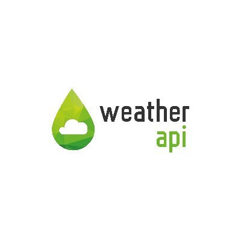
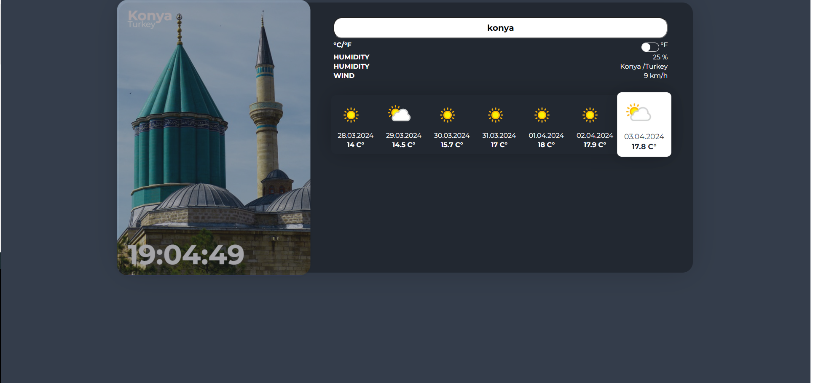
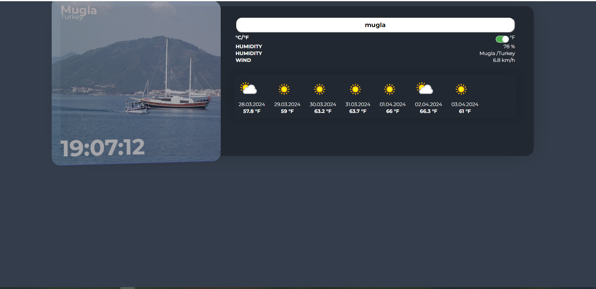

<h1 align ="center">
   
  
   
 Weather Project
   
</h1>

## Project Information
---
The project shows the weather and visuals of the city by location. The app can show a 7-day weather forecast.
Project Data 
Weather forecast : Data is read from WeatherAPI with axios.
Pictures of the city : Data is read from PixabayAPI with axios.
Since the project is a small scale project, we moved the data to the components with props.

  <table style="border: none">
    <tr>
      <td style="border: none;" align="center"> 
React
</a></td>
      <td style="border: none;" align="center"> 
TypeScript
</a></td>
      <td style="border: none;" align="center"> 
WeatherAPI
</td>
      <td style="border: none;" align="center"> 
PixabayAPI
</td>
    </tr>
  </table>

## Project Images
  
  
   
  

